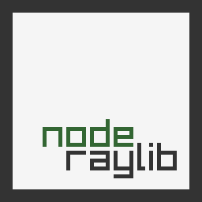
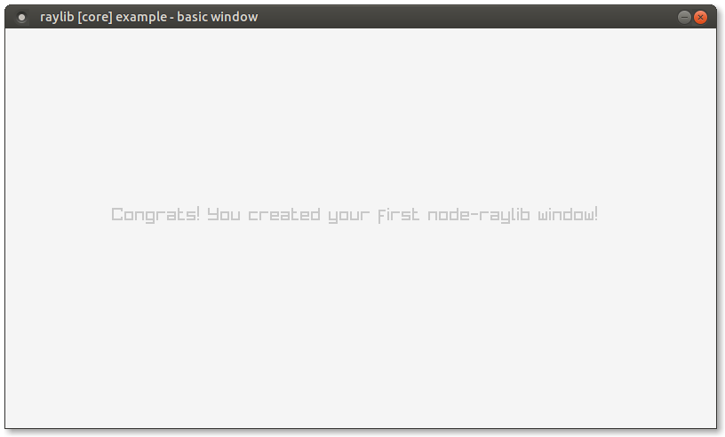

# node-raylib [](https://npmjs.org/package/raylib "View this project on npm") [](https://github.com/RobLoach/node-raylib/actions?query=workflow%3ATests+branch%3Amaster "See automated test status on GitHub Actions")

[Node.js](https://nodejs.org) bindings for [raylib](https://www.raylib.com/), a simple and easy-to-use library to enjoy videogames programming (www.raylib.com).

## Examples

| Name | Description | Author |
|:-----|:------------|:-------|
| [Offical Examples](examples) | Ports of raylib's examples to node-raylib | [@RobLoach](https://github.com/robloach), [@twunky](https://github.com/twuky), [@konsumer](https://github.com/konsumer) |
| [Flappy](https://github.com/arthurmassanes/flappy) | A [Flappy Bird](https://en.wikipedia.org/wiki/Flappy_Bird) clone | [@arthurmassanes](https://github.com/arthurmassanes) |
| [Retro RPG Template](https://github.com/notnullgames/raylib-example-retro_rpg) | Small prototype to build a retro-inspired RPG game | [@konsumer](https://github.com/konsumer) |
| [Chip8](https://github.com/taniarascia/chip8) | A [CHIP-8](https://en.wikipedia.org/wiki/CHIP-8) emulator whose native client using node-raylib | [@taniarascia](https://github.com/taniarascia) |

## Dependencies

- [Node.js](https://nodejs.org) >= 10

## Usage

1. Create a new Node.js project:
    ``` bash
    mkdir myexample
    cd myexample
    ```

2. Create a `package.json` file with:
    ``` json
    {
      "dependencies": {
        "raylib": "*"
      },
      "scripts": {
          "start": "node index.js"
      }
    }
    ```

3. Create a `index.js` JavaScript file, like [`core_basic_window.js`](examples/core/core_basic_window.js):
    ``` javascript
    const r = require('raylib')

    const screenWidth = 800
    const screenHeight = 450
    r.InitWindow(screenWidth, screenHeight, "raylib [core] example - basic window")
    r.SetTargetFPS(60)

    while (!r.WindowShouldClose()) {
        r.BeginDrawing();
        r.ClearBackground(r.RAYWHITE)
        r.DrawText("Congrats! You created your first node-raylib window!", 120, 200, 20, r.LIGHTGRAY)
        r.EndDrawing()
    }
    r.CloseWindow()
    ```

4. Have npm install the dependencies for you:
    ``` bash
    npm install
    ```

5. Run `index.js` through Node.js:
    ``` bash
    npm start
    ```
    

Check for more [examples](examples) organized by raylib modules.

## Installation

Raylib is implemented as bindings with [node-addon-api](https://github.com/nodejs/node-addon-api). Bindings are prebuilt for many platforms in [Releases](https://github.com/RobLoach/node-raylib/releases). If your platform is not supported by a prebuilt binary, you will need CMake to build the native addon. Windows users building manually will also require MSVC Build Tools 2019, or Visual Studio 2019 with build tools for C/C++.

In general, to install node-raylib locally, use [npm](https://www.npmjs.com/):
```
npm install raylib
```

## DRM
On some ARM devices like Raspberry PI, raylib can be used in a DRM mode instead of rendering to an x11 window. This version requires a seperate
native addon, and on installation on ARM devices node-raylib will include both. To use the DRM mode, import `raylib/drm` instead.
```js
import * as rl from 'raylib/drm/index.js'
const rl = require('raylib/drm')
```

### CLI

The project comes with a [`node-raylib`](https://github.com/RobLoach/node-raylib/blob/master/bin/node-raylib) command-line tool to run `node-raylib` files directly:

``` bash
# Unix
./bin/node-raylib core_basic_window.js

# Windows
node bin/node-raylib core_basic_window.js
```

The CLI can be installed globally through `npm` or `npx` for no-install:

``` bash
npm install raylib --global
node-raylib --version
npx -y raylib --version
```

## Development

[node-addon-api](https://github.com/nodejs/node-addon-api) is used to construct the bindings. Raylib provides a header parser that generates a JSON file containing information on the API. The code binding raylib to NodeJS is automatically generated based on this file. For information on how bindings are written for raylib read the [documentation](docs). Code generators for the C++ bindings, TypeScript definitions, and JavaScript wrapper functions are found in the [tools/generate_templates folder](tools/generate_templates).

### Testing
Run the following to run tests...

```
git clone https://github.com/RobLoach/node-raylib.git
cd node-raylib
npm i
npm t
```

### TypeScript Definitions

Typescript definitions are provided by a generator based on raylib's header parser. See [node-raylib-definitions.js](tools/generate_templates/node-raylib-definitions.js) for information on how to generate them.

### Package

To build the packaged releases, use the following command:

```
npm run pkg
```

## License

*node-raylib* is licensed under an unmodified zlib/libpng license, which is an OSI-certified,
BSD-like license that allows static linking with closed source software. Check [LICENSE](LICENSE) for further details.

*Copyright (c) 2022 Rob Loach ([@RobLoach](https://twitter.com/RobLoach))*
